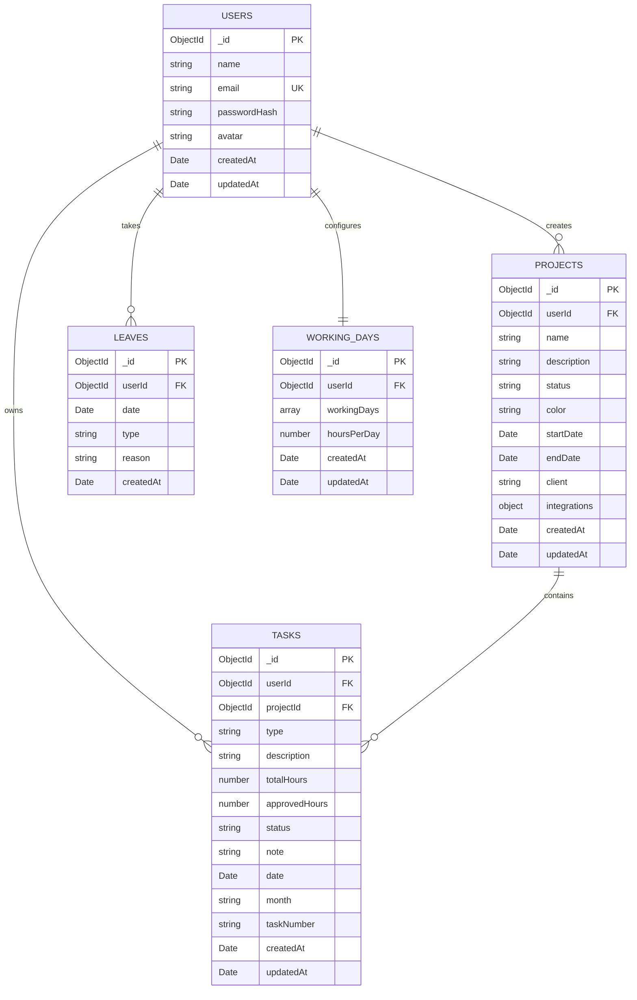

# TaskFlow - Daily Task & Project Management System

## Project Overview

TaskFlow is a comprehensive daily task and project management application built with modern web technologies. It provides a complete solution for tracking tasks, managing projects, analyzing productivity, and integrating with external project management tools like Jira and Redmine. The application features a clean, responsive interface with dark/light theme support and robust authentication system.

### Key Goals
- **Productivity Tracking**: Monitor daily tasks, working hours, and productivity metrics
- **Project Management**: Organize tasks by projects with status tracking and client management
- **Analytics Dashboard**: Visualize productivity trends and performance metrics
- **External Integrations**: Connect with Jira and Redmine for seamless workflow
- **User Experience**: Provide an intuitive, responsive interface for all devices

## Tech Stack

### Frontend Framework
- **Next.js 15.4.1** - React framework with App Router for server-side rendering and routing
- **React 19.1.0** - Latest React with concurrent features and improved performance
- **TypeScript 5** - Type-safe development with enhanced developer experience

### UI & Styling
- **Tailwind CSS 4** - Utility-first CSS framework for rapid UI development
- **Radix UI** - Accessible, unstyled component primitives for building design systems
- **Shadcn/ui** - Beautiful, accessible component library built on Radix UI
- **Lucide React** - Modern, customizable icon library
- **Framer Motion 12.23.6** - Smooth animations and transitions
- **Class Variance Authority** - Component variant management utility

### Backend & Database
- **MongoDB 6.17.0** - NoSQL database for flexible data storage
- **JWT (jsonwebtoken 9.0.2)** - Secure authentication token management
- **bcryptjs 3.0.2** - Password hashing and security

### Form Handling & Validation
- **React Hook Form 7.60.0** - Performant form library with minimal re-renders
- **Zod 4.0.5** - TypeScript-first schema validation
- **@hookform/resolvers 5.1.1** - Form validation integration

### Data Visualization & Export
- **Recharts 3.1.0** - Composable charting library for React
- **ExcelJS 4.4.0** - Excel file generation and manipulation
- **json2csv 6.0.0** - CSV export functionality
- **date-fns 4.1.0** - Modern JavaScript date utility library

### Development Tools
- **ESLint 9** - Code linting and formatting
- **PostCSS** - CSS processing and optimization

## Folder Structure

```
src/
├── app/                           # Next.js App Router
│   ├── api/                      # Backend API routes
│   │   ├── auth/                 # Authentication endpoints
│   │   │   ├── login/           # User login
│   │   │   ├── register/        # User registration
│   │   │   └── logout/          # User logout
│   │   ├── tasks/               # Task management endpoints
│   │   ├── projects/            # Project management endpoints
│   │   ├── analytics/           # Analytics and metrics endpoints
│   │   ├── leaves/              # Leave management endpoints
│   │   ├── working-days/        # Working days configuration
│   │   ├── integrations/        # External tool integrations
│   │   └── user/                # User profile management
│   ├── dashboard/               # Main dashboard page
│   ├── analytics/               # Analytics dashboard page
│   ├── projects/                # Projects management page
│   ├── settings/                # Application settings page
│   ├── login/                   # Authentication pages
│   ├── signup/                  # User registration pages
│   ├── reset-password/          # Password reset functionality
│   ├── globals.css              # Global styles and CSS variables
│   ├── layout.tsx               # Root layout with providers
│   └── page.tsx                 # Home page with auth routing
├── components/                   # React components
│   ├── ui/                      # Reusable UI components (Shadcn/ui)
│   │   ├── button.tsx           # Button component variants
│   │   ├── card.tsx             # Card layout component
│   │   ├── dialog.tsx           # Modal dialog component
│   │   ├── form.tsx             # Form components with validation
│   │   ├── input.tsx            # Input field component
│   │   ├── select.tsx           # Dropdown select component
│   │   ├── table.tsx            # Data table component
│   │   └── ...                  # Other UI primitives
│   ├── auth/                    # Authentication components
│   │   ├── login-form.tsx       # Login form component
│   │   ├── signup-form.tsx      # Registration form component
│   │   ├── protected-route.tsx  # Route protection wrapper
│   │   └── session-manager.tsx  # Session management
│   ├── dashboard/               # Dashboard-specific components
│   │   ├── dashboard-content.tsx # Main dashboard layout
│   │   └── dashboard-skeleton.tsx # Loading skeleton
│   ├── analytics/               # Analytics components
│   │   ├── productivity-metrics.tsx # Metrics overview cards
│   │   └── productivity-trends.tsx  # Trend visualization charts
│   ├── settings/                # Settings page components
│   │   ├── projects-management.tsx    # Project CRUD interface
│   │   ├── leave-management.tsx       # Leave tracking interface
│   │   ├── working-days-form.tsx      # Working days configuration
│   │   └── project-tools-integration.tsx # External tool setup
│   ├── theme/                   # Theme management
│   │   └── provider.tsx         # Theme context provider
│   ├── navbar.tsx               # Main navigation component
│   ├── task-form.tsx            # Task creation/editing form
│   ├── task-list.tsx            # Task list with filtering
│   └── theme-toggle.tsx         # Dark/light mode toggle
├── contexts/                    # React contexts
│   ├── auth-context.tsx         # Authentication state management
│   └── index.ts                 # Context exports
├── hooks/                       # Custom React hooks
│   ├── use-auth.ts              # Authentication hook
│   └── useProductivityMetrics.ts # Productivity calculations hook
├── lib/                         # Utility libraries
│   ├── api/                     # API client configuration
│   │   └── client.ts            # Axios-based API client
│   ├── db/                      # Database configuration
│   │   └── mongodb.ts           # MongoDB connection setup
│   ├── services/                # Business logic services
│   │   ├── auth.service.ts      # Authentication service
│   │   ├── task.service.ts      # Task management service
│   │   ├── project.service.ts   # Project management service
│   │   ├── analytics.service.ts # Analytics service
│   │   ├── leave.service.ts     # Leave management service
│   │   ├── integration.service.ts # External integrations service
│   │   └── index.ts             # Service exports
│   ├── types/                   # TypeScript type definitions
│   │   ├── auth.ts              # Authentication types
│   │   └── index.ts             # Common types (Task, Project, etc.)
│   ├── validations/             # Zod validation schemas
│   │   └── auth.ts              # Authentication validation
│   ├── middleware/              # Custom middleware
│   │   └── auth.ts              # JWT authentication middleware
│   ├── export/                  # Data export utilities
│   │   └── excel.ts             # Excel export functionality
│   ├── analytics/               # Analytics utilities
│   │   ├── calculations.ts      # Productivity calculations
│   │   ├── date-utils.ts        # Date manipulation utilities
│   │   └── types.ts             # Analytics type definitions
│   ├── auth.ts                  # Authentication utilities
│   └── utils.ts                 # General utility functions
└── scripts/                     # Utility scripts
    └── setup-test-user.js       # Test user creation script
```

## Key Features

### 🎯 Task Management
- **Comprehensive Task Creation**: Create tasks with detailed information including:
  - Task ID and type (Development, Testing, Design, Bug Fix, Documentation, Meeting)
  - Description and notes
  - Project association with visual color coding
  - Time tracking (total hours and approved hours)
  - Status tracking (To Do, In Progress, Done)
  - Monthly categorization
- **Advanced Filtering & Search**: 
  - Real-time search across all task fields
  - Multi-level filtering by type, project, month, and status
  - Visual filter indicators with easy removal
- **Task Operations**: Edit, delete, and toggle completion status with confirmation dialogs
- **Responsive Table View**: Customizable column visibility for optimal viewing

### 🏗️ Project Management
- **Project Organization**: Create and manage projects with:
  - Custom color coding for visual identification
  - Status tracking (Active, On Hold, Completed, Cancelled)
  - Client association and date tracking
  - Detailed descriptions and notes
- **External Tool Integration**:
  - **Jira Integration**: Connect to Jira Cloud/Server instances with project key mapping
  - **Redmine Integration**: Link to Redmine projects with direct access
  - Direct links to external tools from project listings
- **Project Analytics**: Track tasks and productivity metrics per project

### 📊 Analytics Dashboard
- **Productivity Metrics**: Comprehensive overview including:
  - Total tasks completed
  - Approved working hours
  - Working days calculation (8 hours = 1 day)
  - Leave days tracking
  - Productivity percentage calculation
- **Visual Analytics**:
  - Interactive productivity trend charts
  - Monthly performance tracking
  - Progress indicators and visual metrics
- **Time-based Analysis**: Working hours to days conversion with leave impact analysis

### 🔐 Authentication & Security
- **Secure Authentication**: JWT-based authentication with:
  - User registration and login
  - Password reset functionality
  - Session management and validation
  - Protected routes and middleware
- **User Management**: Profile management with avatar support

### 🎨 User Experience
- **Theme Support**: Dark/light mode toggle with system preference detection
- **Responsive Design**: Optimized for desktop, tablet, and mobile devices
- **Loading States**: Skeleton loaders and proper error handling
- **Notifications**: Toast notifications for user feedback
- **Accessibility**: Screen reader support and keyboard navigation

### 📤 Data Export
- **Excel Export**: Export tasks and analytics data to Excel with:
  - Integration links included
  - Formatted productivity metrics
  - Project information and task details

### ⚙️ Settings & Configuration
- **Leave Management**: Track and manage leave days
- **Working Days Configuration**: Set up working day preferences
- **Project Tools Integration**: Configure Jira and Redmine connections
- **User Preferences**: Customize application settings

## Application Flow

### Data Flow Architecture

The application follows a modern client-server architecture with clear separation of concerns:

1. **Frontend (Next.js/React)**:
   - User interactions trigger React component state changes
   - Components use custom hooks for business logic
   - Services handle API communication
   - Context providers manage global state (auth, theme)

2. **API Layer (Next.js API Routes)**:
   - RESTful endpoints handle HTTP requests
   - JWT middleware validates authentication
   - Business logic processes data
   - Database operations through MongoDB client

3. **Database (MongoDB)**:
   - Document-based storage for flexible data models
   - Collections: users, tasks, projects, leaves, working_days
   - Indexed queries for performance optimization

### Request Flow Example (Creating a Task):
```
User Input → TaskForm Component → taskService.createTask() → 
POST /api/tasks → Auth Middleware → MongoDB Insert → 
Response → Service → Component State Update → UI Refresh
```

## User Flow Diagram

### Main Application Flow


**Alternative Text-Based Flow:**
```
┌─────────────────┐
│  User Visits    │
│      App        │
└─────────┬───────┘
          │
          ▼
    ┌─────────────┐      ┌──────────────────┐
    │Authenticated?├─No──►│ Login/Register   │
    │             │      │      Page        │
    └─────┬───────┘      └─────────┬────────┘
          │Yes                     │
          ▼                        ▼
    ┌─────────────┐           ┌─────────────┐
    │  Dashboard  │◄──────────┤Enter Creds  │
    │             │           │& Validate   │
    └─────┬───────┘           └─────────────┘
          │
          ├─── View Tasks ────────┐
          ├─── Create New Task ───┤
          ├─── View Analytics ────┤
          ├─── Manage Projects ───┤
          └─── Settings ──────────┘
```

> **📋 To View Mermaid Diagrams Properly:**
> 1. **GitHub** (Recommended): Upload this file to GitHub - native Mermaid support
> 2. **Online Tools**: Copy Mermaid code to https://mermaid.live/
> 3. **Desktop Apps**: Use Typora, Mark Text, or Obsidian
> 4. **VS Code**: Install Mermaid preview extensions
> 5. **GitLab/Bitbucket**: Both support Mermaid rendering

### Task Management Flow


### Project Integration Flow


## Architecture Diagram

### System Architecture Overview


### Database Schema Relationships


### Component Hierarchy


### Analytics Data Flow


## Authentication Flow

The application implements a comprehensive JWT-based authentication system:

### Authentication Process:

1. **User Registration/Login**:
   - User submits credentials via login/signup forms
   - Backend validates credentials against MongoDB users collection
   - Password hashing using bcryptjs for security
   - JWT token generated with user payload (userId, email, name)
   - Token stored in localStorage on client-side

2. **Session Management**:
   - AuthContext provides global authentication state
   - Automatic session validation on app initialization
   - Periodic token validation (every 5 minutes)
   - Token expiration handling with automatic logout

3. **Protected Routes**:
   - ProtectedRoute component wraps authenticated pages
   - Middleware validates JWT tokens on API requests
   - Automatic redirection to login for unauthorized access
   - Route guards prevent access to auth pages when logged in

4. **Token Security**:
   - JWT tokens include expiration timestamps
   - Secure token storage and retrieval utilities
   - Token validation on both client and server sides
   - Automatic cleanup on logout

### Authentication Flow Diagram:


### Complete API Request Flow


### State Management Flow


## Important Components/Modules

### Core Components

#### 1. **TaskForm Component** (`src/components/task-form.tsx`)
- **Purpose**: Handles task creation and editing with comprehensive form validation
- **Features**: 
  - React Hook Form integration with Zod validation
  - Project selection with color-coded options
  - Task type categorization
  - Time tracking inputs
  - Status management
- **Reusability**: Used in both create and edit modes with conditional rendering

#### 2. **TaskList Component** (`src/components/task-list.tsx`)
- **Purpose**: Displays tasks in a responsive table with advanced filtering
- **Features**:
  - Real-time search across multiple fields
  - Multi-level filtering (type, project, month, status)
  - Column visibility customization
  - Inline actions (edit, delete, toggle completion)
- **Performance**: Optimized rendering with proper key props and memoization

#### 3. **ProductivityMetrics Component** (`src/components/analytics/productivity-metrics.tsx`)
- **Purpose**: Displays comprehensive productivity analytics
- **Features**:
  - Key performance indicators (KPIs)
  - Visual progress indicators
  - Time-based calculations
  - Leave impact analysis
- **Data Source**: Integrates with useProductivityMetrics hook

#### 4. **Navbar Component** (`src/components/navbar.tsx`)
- **Purpose**: Main navigation with user management
- **Features**:
  - User profile dropdown
  - Theme toggle integration
  - Notification system
  - Responsive design
- **Authentication**: Integrates with AuthContext for user state

### Service Modules

#### 1. **Authentication Service** (`src/lib/services/auth.service.ts`)
- **Purpose**: Centralized authentication operations
- **Methods**:
  - `login()`: User authentication with credential validation
  - `register()`: New user registration
  - `logout()`: Session termination
  - `getCurrentUser()`: Profile retrieval
  - `forgotPassword()`: Password reset initiation
- **Security**: JWT token management and secure storage

#### 2. **Task Service** (`src/lib/services/task.service.ts`)
- **Purpose**: Task management operations
- **Methods**:
  - `getTasks()`: Retrieve tasks with filtering options
  - `createTask()`: Create new tasks with validation
  - `updateTask()`: Modify existing tasks
  - `deleteTask()`: Remove tasks with confirmation
  - `toggleTaskCompletion()`: Status management
- **Integration**: Works with project service for data enrichment

#### 3. **Project Service** (`src/lib/services/project.service.ts`)
- **Purpose**: Project management and integration handling
- **Methods**:
  - `getProjects()`: Retrieve user projects
  - `createProject()`: Create projects with integration setup
  - `updateProject()`: Modify project details and integrations
  - `deleteProject()`: Remove projects with dependency checks
- **Integrations**: Handles Jira and Redmine configuration

#### 4. **Analytics Service** (`src/lib/services/analytics.service.ts`)
- **Purpose**: Productivity analytics and reporting
- **Methods**:
  - `getProductivityOverview()`: Comprehensive metrics calculation
  - `getProductivityTrends()`: Historical trend analysis
  - `exportData()`: Data export in multiple formats
- **Performance**: Optimized queries and caching strategies

### Custom Hooks

#### 1. **useProductivityMetrics Hook** (`src/hooks/useProductivityMetrics.ts`)
- **Purpose**: Calculates productivity metrics from task data
- **Features**:
  - Real-time metric calculations
  - Leave impact analysis
  - Working day conversions
  - Productivity percentage computation
- **Optimization**: Memoized calculations to prevent unnecessary re-renders

#### 2. **useAuth Hook** (`src/hooks/use-auth.ts`)
- **Purpose**: Authentication state management
- **Features**:
  - Global authentication state
  - Login/logout operations
  - Session validation
  - Error handling
- **Integration**: Works with AuthContext for state consistency

### Database Models

#### Collections Structure:

1. **Users Collection**:
   ```typescript
   {
     _id: ObjectId,
     name: string,
     email: string,
     passwordHash: string,
     avatar?: string,
     createdAt: Date,
     updatedAt: Date
   }
   ```

2. **Tasks Collection**:
   ```typescript
   {
     _id: ObjectId,
     userId: ObjectId,
     projectId: ObjectId,
     type: string,
     description: string,
     totalHours: number,
     approvedHours: number,
     status: 'pending' | 'in-progress' | 'completed',
     note?: string,
     date: Date,
     month: string,
     taskNumber?: string,
     createdAt: Date,
     updatedAt: Date
   }
   ```

3. **Projects Collection**:
   ```typescript
   {
     _id: ObjectId,
     userId: ObjectId,
     name: string,
     description?: string,
     status: 'active' | 'on-hold' | 'completed' | 'cancelled',
     color: string,
     startDate: Date,
     endDate?: Date,
     client?: string,
     integrations?: {
       jira?: { url: string, projectKey: string },
       redmine?: { url: string, projectId: string }
     },
     createdAt: Date,
     updatedAt: Date
   }
   ```

## How to Run the Project

### Prerequisites
- **Node.js 18+** and npm/yarn/pnpm/bun
- **MongoDB** (local installation or cloud instance)
- **Git** for version control

### Development Setup

1. **Clone the Repository**
   ```bash
   git clone <repository-url>
   cd daily-task-tracker
   ```

2. **Install Dependencies**
   ```bash
   npm install
   # or
   yarn install
   # or
   pnpm install
   # or
   bun install
   ```

3. **Environment Configuration**
   
   Create a `.env.local` file in the root directory:
   ```env
   # MongoDB Connection
   MONGODB_URI=mongodb://localhost:27017/daily-task-tracker
   
   # JWT Secret (change for production)
   JWT_SECRET=your-super-secret-jwt-key-change-this-in-production
   
   # Next.js API Base URL
   NEXT_PUBLIC_API_BASE_URL=/api
   
   # Environment
   NODE_ENV=development
   ```

4. **Database Setup**
   
   **Option A: Local MongoDB**
   - Install MongoDB locally
   - Start MongoDB service
   - Database and collections will be created automatically
   
   **Option B: MongoDB Atlas (Cloud)**
   - Create a MongoDB Atlas account
   - Create a new cluster
   - Get connection string and update `MONGODB_URI`

5. **Run Development Server**
   ```bash
   npm run dev
   # or
   yarn dev
   # or
   pnpm dev
   # or
   bun dev
   ```

6. **Access Application**
   - Open [http://localhost:3000](http://localhost:3000)
   - Create a new account or use the test user setup script

### Production Deployment

#### Vercel (Recommended)
1. **Connect Repository**
   - Push code to GitHub/GitLab/Bitbucket
   - Connect repository to Vercel
   
2. **Environment Variables**
   - Set production environment variables in Vercel dashboard
   - Ensure `JWT_SECRET` is a secure random string
   - Configure `MONGODB_URI` for production database

3. **Deploy**
   - Vercel automatically deploys on push to main branch
   - Zero-configuration deployment

#### Other Platforms
- **Netlify**: Configure build settings and environment variables
- **AWS Amplify**: Set up hosting with environment configuration
- **Railway**: Connect repository and configure environment
- **DigitalOcean App Platform**: Deploy with managed database

### Available Scripts

```bash
# Development
npm run dev          # Start development server with hot reload

# Production
npm run build        # Build optimized production bundle
npm run start        # Start production server

# Code Quality
npm run lint         # Run ESLint for code quality checks

# Database
node scripts/setup-test-user.js  # Create test user for development
```

### Testing the Application

1. **Create Test User**
   ```bash
   node scripts/setup-test-user.js
   ```

2. **Login Credentials**
   - Email: test@example.com
   - Password: password123

3. **Test Features**
   - Create projects with different statuses
   - Add tasks with various types and time tracking
   - Test filtering and search functionality
   - Explore analytics dashboard
   - Configure external integrations (optional)

## Future Improvements

### Performance Optimizations
- **Database Indexing**: Implement compound indexes for frequently queried fields
- **Caching Strategy**: Add Redis caching for analytics calculations
- **Lazy Loading**: Implement code splitting for better initial load times
- **Image Optimization**: Add image compression and CDN integration
- **API Rate Limiting**: Implement rate limiting for API endpoints

### Feature Enhancements
- **Team Collaboration**: Multi-user project sharing and task assignment
- **Advanced Analytics**: 
  - Burndown charts and velocity tracking
  - Time tracking with start/stop functionality
  - Detailed reporting with custom date ranges
- **Mobile Application**: React Native app for mobile task management
- **Offline Support**: PWA capabilities with offline data synchronization
- **Advanced Integrations**:
  - GitHub integration for commit tracking
  - Slack notifications for task updates
  - Google Calendar integration for time blocking

### User Experience Improvements
- **Drag & Drop**: Task reordering and status updates via drag and drop
- **Keyboard Shortcuts**: Power user shortcuts for common actions
- **Advanced Search**: Full-text search with filters and saved searches
- **Customizable Dashboard**: Widget-based dashboard with user preferences
- **Bulk Operations**: Multi-select for bulk task operations

### Security Enhancements
- **Two-Factor Authentication**: Enhanced security with 2FA support
- **Role-Based Access Control**: Different permission levels for team members
- **Audit Logging**: Comprehensive activity logging for security monitoring
- **Data Encryption**: End-to-end encryption for sensitive data

### Infrastructure Improvements
- **Microservices Architecture**: Split into smaller, focused services
- **Container Deployment**: Docker containerization for consistent deployments
- **CI/CD Pipeline**: Automated testing and deployment workflows
- **Monitoring & Alerting**: Application performance monitoring and error tracking
- **Backup Strategy**: Automated database backups and disaster recovery

### Integration Expansions
- **Microsoft Project**: Integration with Microsoft Project for enterprise users
- **Asana/Trello**: Additional project management tool integrations
- **Time Tracking Tools**: Integration with Toggl, Harvest, or similar tools
- **Calendar Applications**: Sync with Outlook, Google Calendar for scheduling
- **Communication Tools**: Integration with Microsoft Teams, Discord

---

**Built with ❤️ using Next.js 15, React 19, TypeScript, and MongoDB**

*This documentation provides a comprehensive overview of the TaskFlow application architecture, features, and setup instructions. For specific implementation details, refer to the source code and inline documentation.*